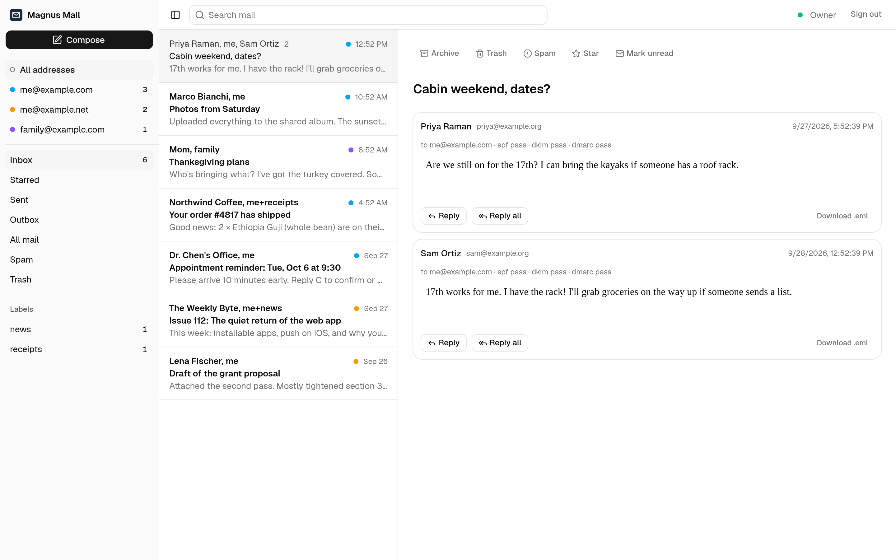
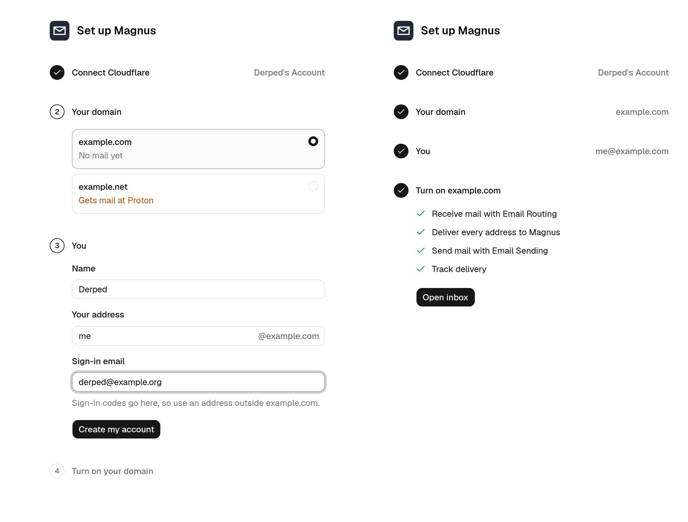

# Magnus

Self-hosted email for your own domains, running entirely on Cloudflare. There's no mail server to patch and
no IP reputation to nurse: Email Routing receives, Email Sending delivers, a single Worker with Durable
Objects, D1, R2, and Queues handles everything in between, and a fast web client sits on top.

[](https://deploy.workers.cloudflare.com/?url=https://github.com/Derpedyea/magnus)



> **Status: early.** Receiving, threading, search, sending, and delivery tracking work end to end. It's built
> for a few people on a few domains. Read [the constraints](docs/ARCHITECTURE.md#1-what-the-platform-gives-us-and-doesnt)
> before moving real mail onto it.

## Features

- **Every address, one inbox.** Any number of domains and addresses feed one mailbox. Filter by address in a
  click. Group addresses like `family@` deliver a copy to each person.
- **`+tag` becomes a label.** Mail to `me+receipts@` lands under *receipts* automatically.
- **Set up and run from the app.** Add domains, people, and addresses in the admin pages. Magnus turns on
  Email Routing and Email Sending in Cloudflare for you, and MTA-STS, so other servers deliver your mail only
  over an encrypted connection.
- **Rejects during the SMTP session.** Unknown recipients and blocked senders bounce before the message is
  accepted, so Magnus never sends backscatter.
- **Real threading** by `Message-ID`/`References`, with a careful subject fallback. Replies thread in Gmail,
  Apple Mail, and Outlook too.
- **Conversations branch where they fork.** When two people answer the same message, each reply hangs off it
  with its own follow-ups, and the history a reply quotes folds away behind a •••.
- **Forwards that look like the original.** Its HTML, images, and the files you keep go along, under a Gmail-style
  header, and the forward stays in the conversation.
- **Full-text search**, undo send, and a delivery badge on every sent message (delivered, bounced, …). Mail
  that didn't make it says who missed it, and Retry sends it again to just them.
- **Write in markdown, see it formatted.** Bold, lists, quotes, and links show as you type them, or from the
  bar over a selection. Mail goes out as HTML with a plain-text part that reads the same.
- **Recipients autocomplete** from everyone you've written to or heard from, and each address you send as
  can have its own signature, formatted the same way.
- **Previews** for photos, video, audio, and PDFs, in the app and on the page a file link opens. Video
  streams, so it plays and seeks without downloading first.
- **Big files go as links.** Whatever doesn't fit in a message is sent as a download link, like Gmail's Drive
  links. It keeps working until you stop sharing it from Sent.
- **At home on a phone.** The list and a thread take turns filling the screen, Compose floats over the list and
  opens full screen with Send above the keyboard, and newsletters laid out for a desktop shrink to fit.
- **Live updates** over hibernatable WebSockets, so idle tabs cost nothing.
- **Trash you can empty.** Permanently delete trashed messages in a conversation or empty Trash for the addresses
  in view, with confirmation. Files still used by other mail stay; failed storage cleanup retries automatically.
- **Hostile HTML stays contained**: streaming sanitizer, strict CSP, sandboxed iframe, and remote images
  blocked until you ask.
- **Sign in with an emailed code**, or Google if you add it. There's no sign-up; only people you add can get in.
- **Raw messages are kept in R2**, so a parsing bug can be fixed by replaying the queue. Mail that still can't be read
  after its retries goes to **Failed**, to retry or download, rather than being dropped. Permanent deletion removes
  unshared originals after the inbound retry window, and a replay cannot restore deleted mail.

## Deploy

You need a Cloudflare account on **Workers Paid** ($5/month, which includes 3,000 outbound emails) and a
domain on Cloudflare DNS. Everything else for a few people fits in the included usage.

1. **Click Deploy to Cloudflare** above. Cloudflare copies Magnus to your GitHub, creates its database,
   storage, and queues, and deploys it. Keep the pre-filled build and deploy commands; no secrets are needed here.
2. **Open the Worker's URL** (`magnus.<your-subdomain>.workers.dev`). It starts at setup.
3. **Paste a Cloudflare API token, pick your domain, and create your account.** Magnus turns the domain on
   and signs you in.



[docs/DEPLOY.md](docs/DEPLOY.md) covers the token's permissions, deploying from the command line, moving a
domain over from another provider, and updating.

## How it works

```
Internet ── SMTP ──▶ Email Routing ──▶ email() ──▶ raw .eml to R2 ──▶ Queue ──▶ queue(): parse ──▶ Mailbox DO
Browser ── HTTPS ──▶ fetch(): app + API ──────── RPC / WebSocket ────────────────────────────▶ Mailbox DO
                                                          Mailbox DO ── alarm ──▶ Email Sending ──▶ recipients
```

One Worker does it all:

| Part | Code | Role |
| --- | --- | --- |
| `email()` | `worker/mail/` | Accepts or rejects at SMTP time, stores the raw message, queues it |
| `queue()` | `worker/mail/` | Parses queued mail into its mailbox; applies delivery events |
| `fetch()` | `worker/`, `src/` | The React app and its API: mail, setup, and admin |
| `Mailbox` | `worker/mailbox/` | One Durable Object (SQLite) per mailbox: threads, labels, search, outbox, live updates |

`shared/` holds what the app and the Worker both use, and `migrations/` the D1 schema, which the Worker
applies itself. [docs/ARCHITECTURE.md](docs/ARCHITECTURE.md) covers the full design and its tradeoffs.

## Run it locally

Needs Node 22+ and pnpm 10. No Cloudflare account required.

```sh
git clone https://github.com/Derpedyea/magnus && cd magnus
pnpm install
pnpm db:seed:local                            # an admin with one mailbox and three addresses
echo "DEV_USER_EMAIL=dev@localhost" > .dev.vars
pnpm dev                                      # http://localhost:5173
```

You're signed in as the seeded admin (`DEV_USER_EMAIL` only works on localhost). Send it some mail through
the real `email()` handler:

```sh
pnpm mail:test                                                  # → me@example.com
pnpm mail:test "me+receipts@example.com" shop@example.org "Your receipt"
pnpm mail:test me@example.com friend@example.org "Re: hi" --reply-to "<some-message-id@host>"
```

Nothing is really sent locally. Outbound mail, sign-in codes included, is written to `.wrangler/tmp/email/`.

| Command | What it does |
| --- | --- |
| `pnpm dev` | The app and Worker in watch mode, with local D1/R2/Queues in `.wrangler/state/` |
| `pnpm typecheck` | `tsc` for the app, Worker, and test fixtures |
| `pnpm test` | Unit tests and isolated Worker tests for mail, send alarms, and multi-user API permissions |
| `pnpm run deploy` | Typecheck, test, build, then deploy to your Cloudflare account |
| `pnpm cf-typegen` | Regenerate `worker-configuration.d.ts` after changing `wrangler.jsonc` |

## Limitations

- **Web client only.** No IMAP, POP, or JMAP, by design. Phones use the web app.
- **Personal mail, not bulk.** Cloudflare Email Sending is for transactional mail. Don't send newsletters
  from it.
- **Outbound messages max out at 5 MiB** including attachments (inbound allows 25 MiB). Bigger files, up to
  100 MB each, go as download links instead.

Drafts autosave to your account and are available from Drafts on any signed-in device. Close keeps a draft;
the trash button discards it. Conflicting edits from two devices can be kept as a separate copy.

Next up: an installable app, push notifications, forwarding, and importing mail
from other providers. The full list is in [the roadmap](docs/ARCHITECTURE.md#8-roadmap).

## License

[MIT](LICENSE)
